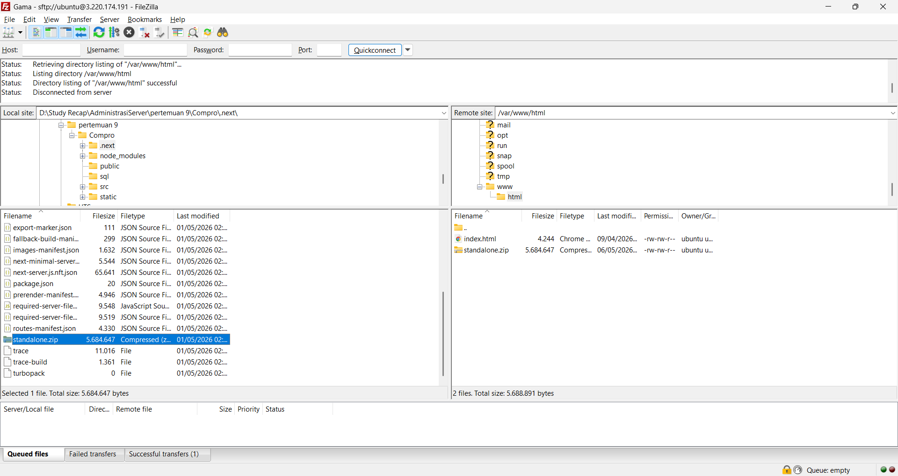
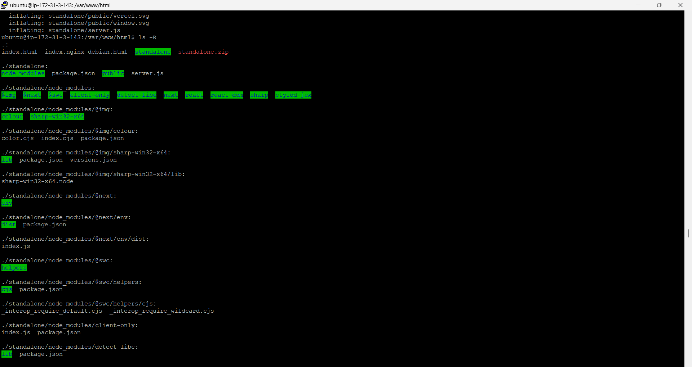
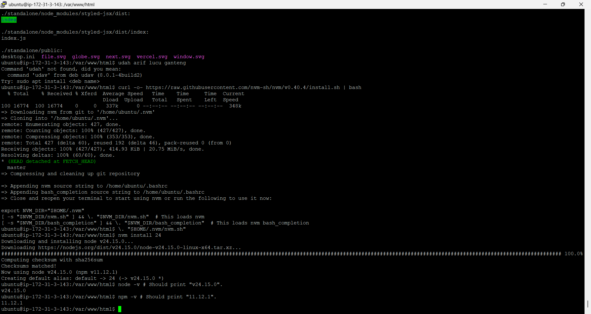
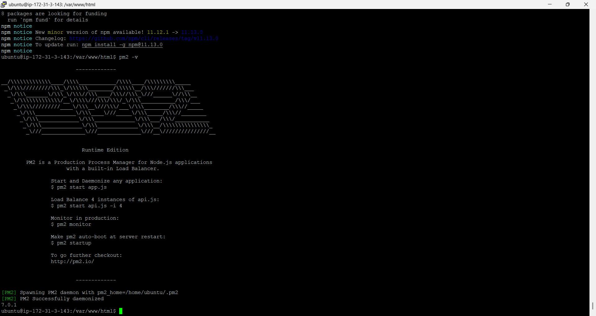
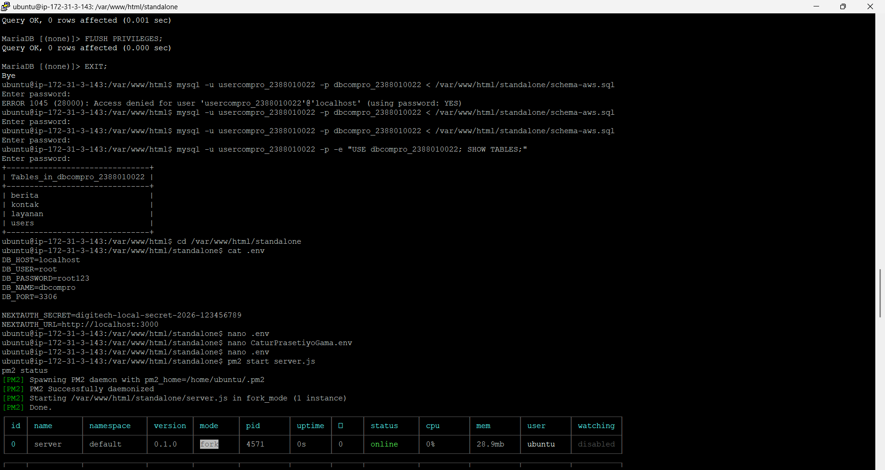
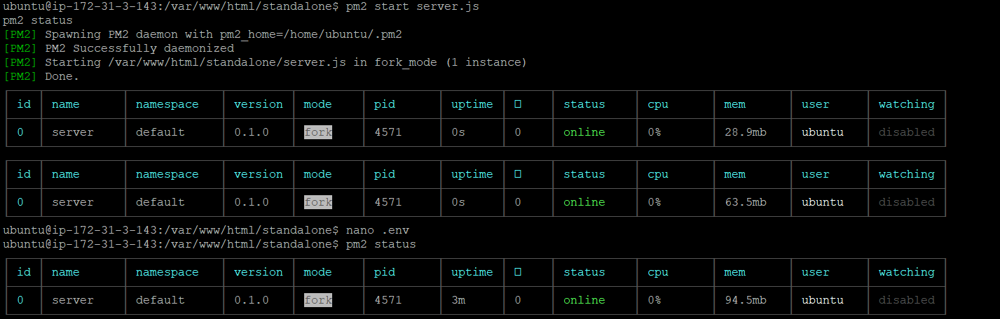
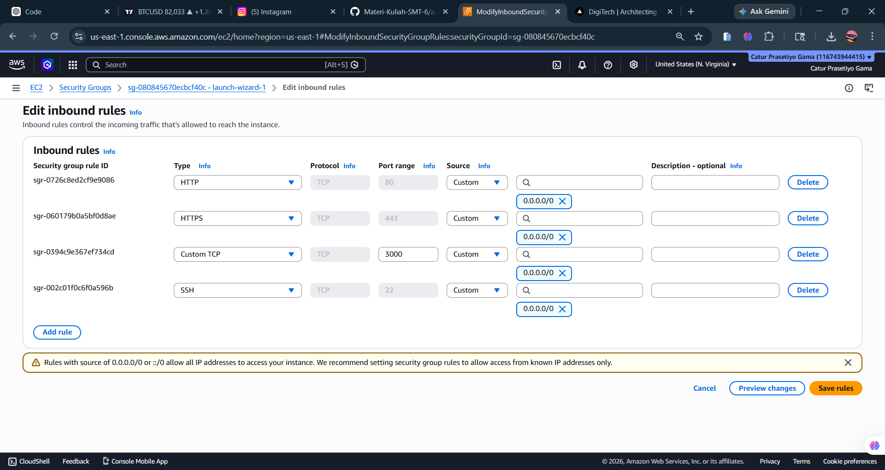
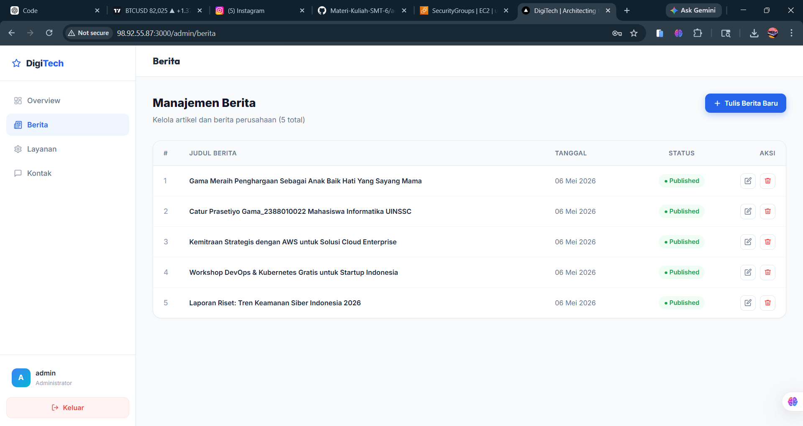
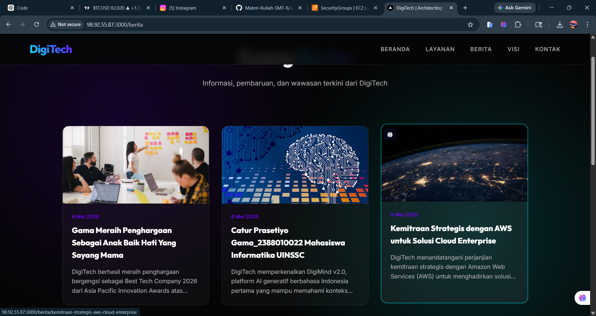

# Migration Standalone Folder to Insteance AWS EC2

# 1. Upload standalone.zip via SFTP Filezilla

# 2. Connect Open SSH 
    ssh -i nama_file.pem ubuntu@[ip addres] / PuTTY
    # Patching OS
    sudo apt update && sudo apt upgrade
# 3. Install Unzip
    "sudo apt install unzip -y"

# 4. Change Directory
    "cd /var/www/html

# 5. Extract standalone.zip
    "unzip standalone.zip"

# 6. check extract result
    "ls -R"

# 7. Install interpreter for apps base node JS 
    # Download and install nvm:
    curl -o- https://raw.githubusercontent.com/nvm-sh/nvm/v0.40.4/install.sh | bash
    # in lieu of restarting the shell
    \. "$HOME/.nvm/nvm.sh"
    # Download and install Node.js:
    nvm install 24
    # Verify the Node.js version:
    node -v # Should print "v24.15.0".
    # Verify npm version:
    npm -v # Should print "11.12.1".

# 8. Install PM2 for Session State
    npm install pm2@latest -g

# 9. Export-Import DB
    Start DBMS (Laragon, xampp, dll)
    Export db_compro
    hapus ENGINE=InnoDB DEFAULT CHARSET=utf8mb4 COLLATE=utf8mb4_0900_ai_ci
    Login usercompro
    use dbcompro_NIM;
    Copy Paste Query ctrl+A file sql export -> Klik Kanan di terminal AWS -show tables;

# 10. Sesuaikan file .env
    cd standalone
    sudo nano .env
    sesuiakn isi .env : DB_HOST=[IP_ADDRESS] DB_USER=usercompro_NIM DB_PASS=[PASSWORD] DB_NAME=dbcompro_NIM
    ctrl+x -> y -> Enter

# 11. Start Server.js

# 12. Tambah port 3000 EC2 di Security Group

# 13. Akses http://[IP_ADDRESS]:3000 & http://[IP_ADDRESS]:3000/admin 
    edit berita ke 2 tambahkan nama - nim

