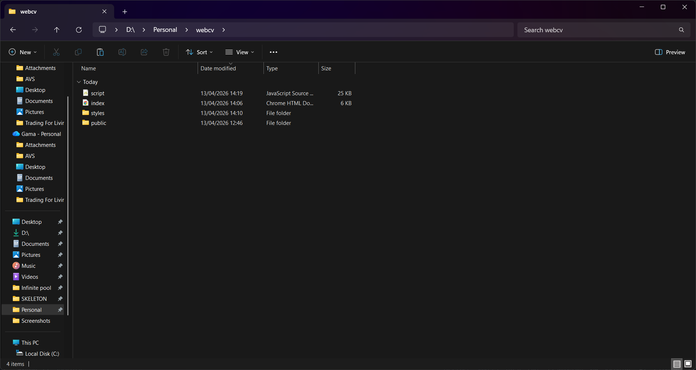
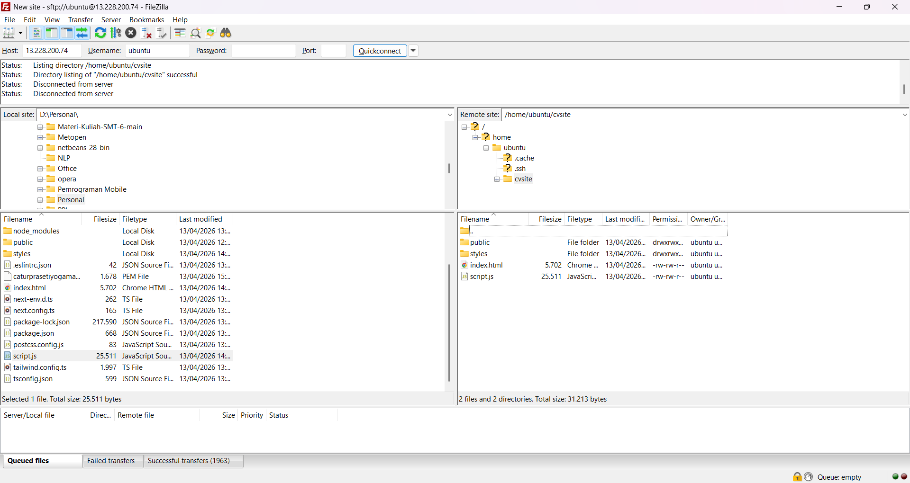

UTS ini bertujuan untuk melakukan deploy website statis berupa CV atau portofolio pribadi ke server AWS dari nol, lalu memastikan website dapat diakses publik, aman, dan terdokumentasi sesuai rubrik penilaian.

Saya menyiapkan file website CV/portofolio statis berbasis HTML, CSS, dan JavaScript yang berisi data diri asli, seperti foto, pendidikan, skill, dan informasi pribadi lainnya.

Saya login ke AWS Console dan memilih region Singapore (ap-southeast-1) sesuai ketentuan soal.

Saya membuat sebuah instance EC2 menggunakan Ubuntu Server 22.04/24.04 LTS dengan tipe t2.micro atau t3.micro, serta storage 8 GB SSD.

Saya menggunakan Key Pair sebagai metode akses ke server agar koneksi SSH lebih aman dan sesuai aturan ujian.
..png>)
Saya membuat dan mengatur Security Group dengan konfigurasi:
Port 80 (HTTP) dibuka untuk Anywhere (0.0.0.0/0) agar website bisa diakses publik, dan Port 22 (SSH) dibatasi hanya untuk My IP agar akses server tetap aman.
..png>)
Setelah instance berjalan, saya mengaktifkan Detailed Monitoring pada EC2 untuk memenuhi kebutuhan monitoring.

Saya membuat Elastic IP, lalu menghubungkannya ke instance EC2 agar alamat IP server tetap permanen dan bisa dipakai saat live checking.

Saya membuat CloudWatch Alarm untuk memantau CPU Utilization > 80% sebagai bentuk monitoring dasar terhadap performa server.
.png>)
Saya melakukan koneksi SSH ke server menggunakan terminal dan file key .pem yang sudah dibuat sebelumnya.

Setelah berhasil masuk ke server, saya menginstal Nginx sebagai web server, lalu memastikan servicenya berstatus active (running) dan enabled.

Saya mengunggah source code website CV ke server menggunakan FileZilla.

Saya memindahkan file website ke document root Nginx, yaitu /var/www/html, agar dapat dilayani oleh web server.

Setelah semua konfigurasi selesai, saya mengambil 4 screenshot wajib, yaitu:
halaman utama EC2 yang menampilkan instance dan Elastic IP, halaman Security Group Inbound Rules, halaman CloudWatch Alarm berstatus OK, dan tampilan terminal saat menjalankan sudo systemctl status nginx.
Seluruh screenshot kemudian saya susun rapi ke dalam 1 file PDF untuk dikumpulkan ke LMS sebagai bukti administrasi dan verifikasi keamanan.
