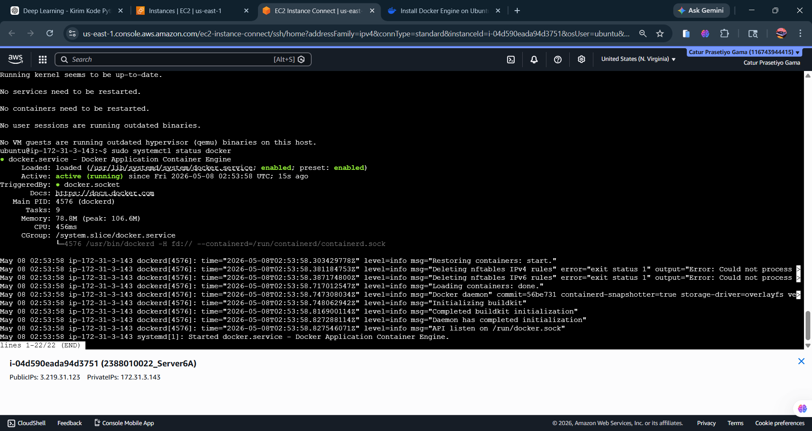
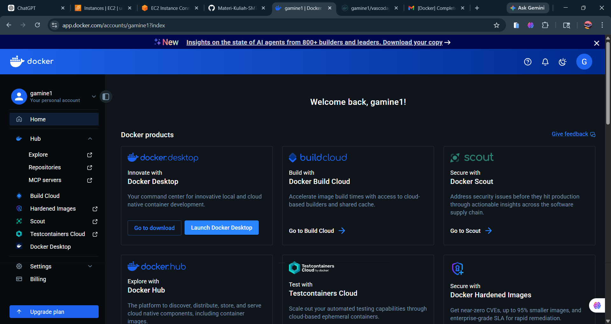
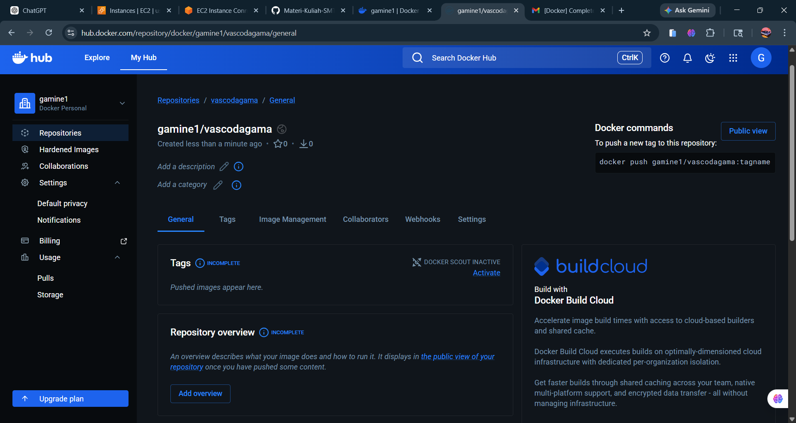
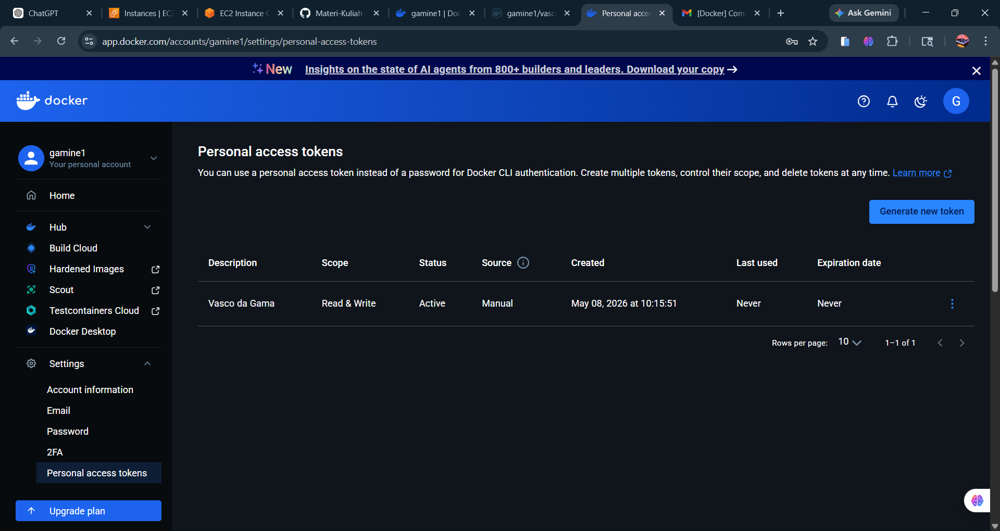
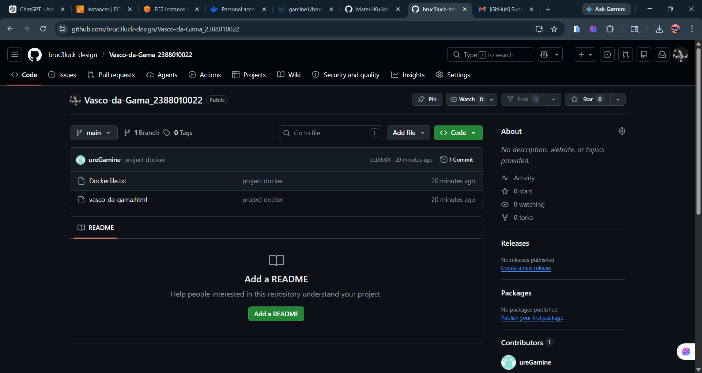
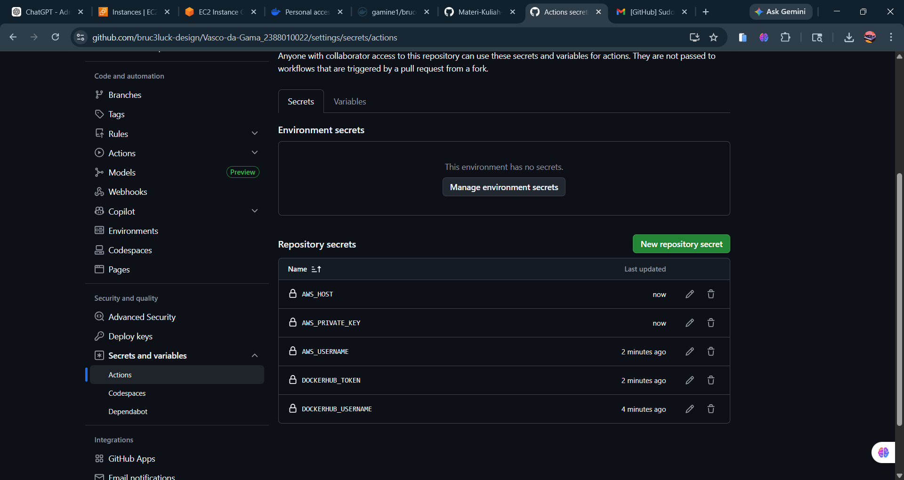
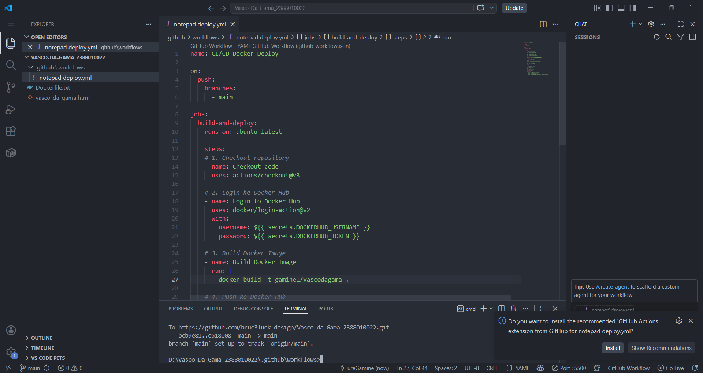

# Docker Engine in Instance EC2 AWS

### 1. start insteance EC2 then open terminal AWS
### 2. Install based Docker Documentation (http://docs.docker.com/engine/install/ubuntu/)
    - Uninstall old version Docker
    - Intall Docker

### 3. Registrasi Docker Hub
    - URL Docker hub -> https://hub.docker.com/signup
    - Continue with Github
    - Login

### 4. Create Repository for Docker
    - Klik Button New Repository
    - Isi Nama Repository = compro_nim dan Deskripsi = Web app statis compro
    - Visibility = Public
    - Klik Create

### 5. Create Token Access
    - Klik Profile->Settings->personal access tokens
    - Klik Generate New Token
    - isi Deskripsi
    - expire date = none
    - access permission = read/write
    - Klik Generate

### 6. Create New Repository Github
    - Create new repository
    - Create local project
    - Push ke Github

### 7. Set Up Github Secret Variables
    - Klik Repo -> Settings -> Secrets and variables -> Actions -> New repository secret
    - Buat secret "DOCKERHUB_USERNAME" with your Docker Hub username
    - Buat secret "DOCKERHUB_TOKEN" with your Docker Hub token
    - AWS_USERNAME isi username EC2 AWS kamu (ubuntu)
    - AWS_PRIVATE_KEY isi private key
    - AWS_HOST isi public IP EC2 AWS kamu

### 8. Membuat CI/CD Workflow (Github Actions) di Repositori Github
    - Buat folder .github/workflows/
    - Buat File deploy.yml di folder .github/workflows/
    - Isi deploy.yml dengan kode berikut:
