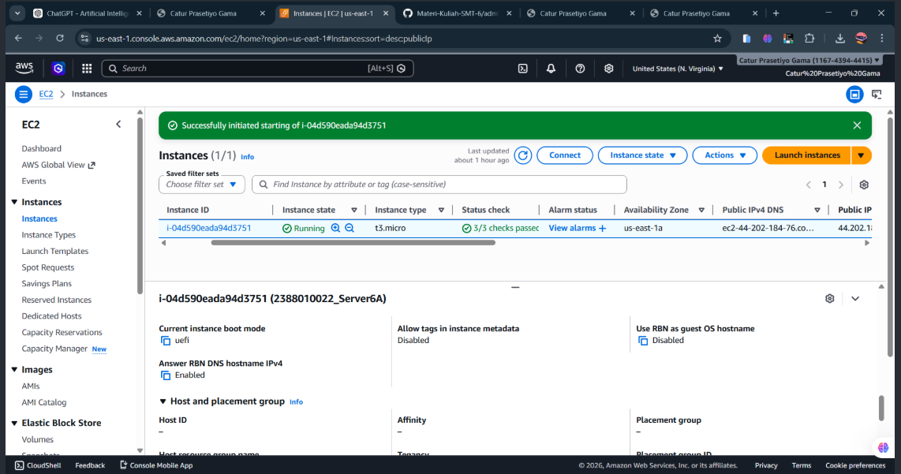
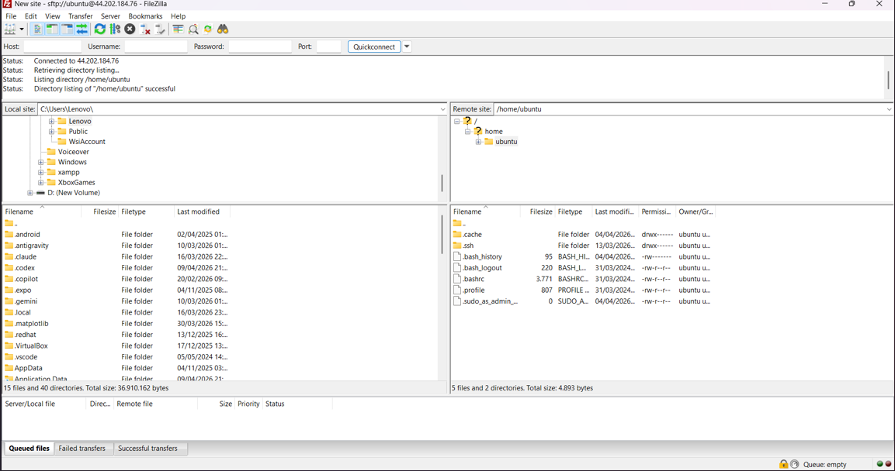
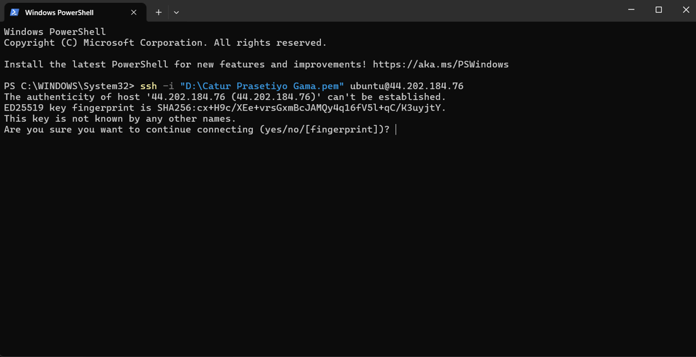
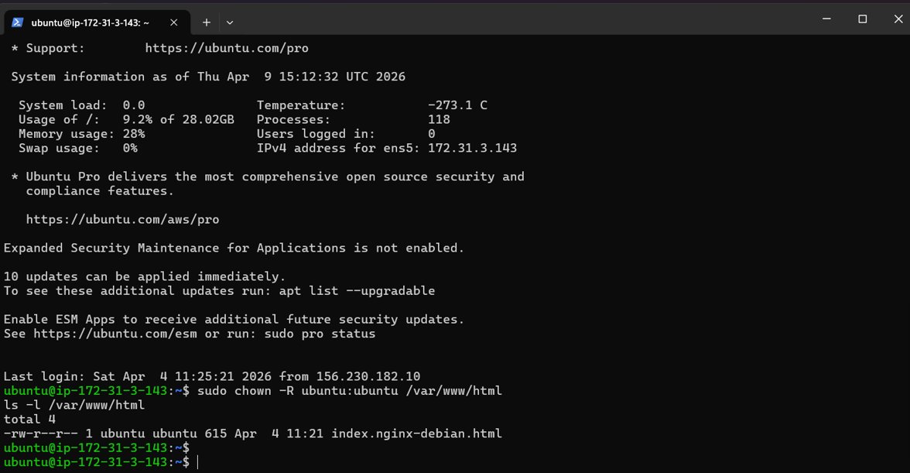
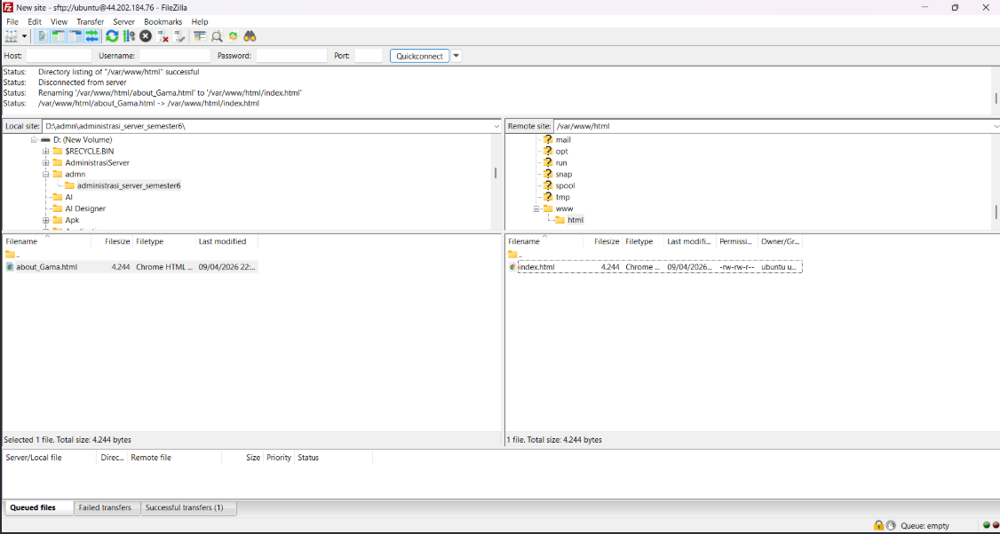
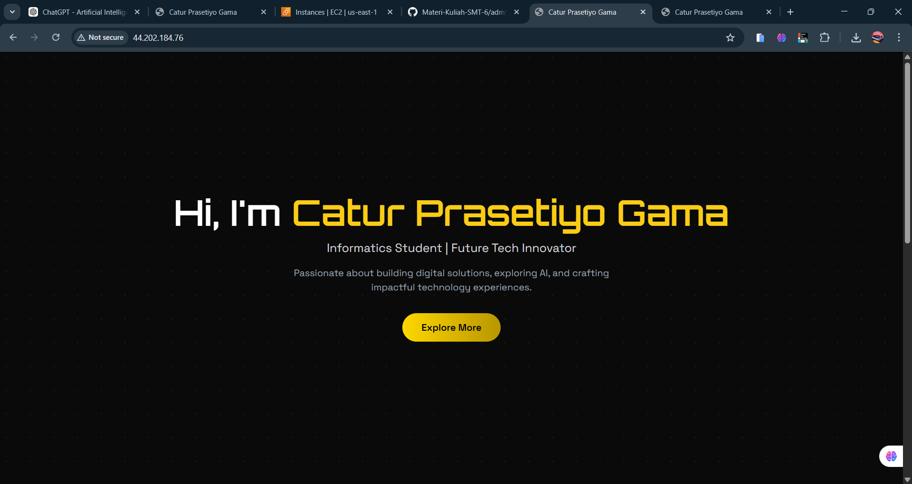

# Pertemuan 4
## Migrasi Data Lokal ke Cloud Menggunakan SFTP dan Manajemen Hak Akses Web

### Tujuan
Pada pertemuan ini, mahasiswa mempraktikkan proses migrasi file website dari komputer lokal ke server cloud AWS EC2 menggunakan protokol SFTP melalui aplikasi FileZilla. Selain itu, dilakukan juga pengaturan hak akses folder web agar file website dapat diunggah dan dikelola dengan baik.

### Tools yang Digunakan
- AWS EC2
- FileZilla Client
- Windows PowerShell
- Web browser
- Private key `.pem`

### Langkah-Langkah Praktik

1. Menyalakan instance EC2 di AWS.
Mahasiswa masuk ke dashboard AWS EC2, kemudian memilih instance yang telah dibuat sebelumnya dan mengubah status instance menjadi `Running`.

2. Menghubungkan FileZilla ke server EC2 menggunakan SFTP.
Mahasiswa membuka aplikasi FileZilla, lalu melakukan konfigurasi koneksi dengan data berikut:
- Protocol: `SFTP - SSH File Transfer Protocol`
- Host: `44.202.184.76`
- Port: `22`
- User: `ubuntu`
- Key file: private key `.pem`

Setelah konfigurasi selesai, mahasiswa menekan tombol `Connect` hingga berhasil terhubung ke server.

3. Mengakses direktori web server.
Setelah berhasil login melalui FileZilla, mahasiswa mengarahkan folder server ke direktori web, yaitu `/var/www/html`.

4. Melakukan remote SSH ke server EC2.
Mahasiswa membuka Windows PowerShell untuk masuk ke server EC2 menggunakan private key `.pem` dengan perintah berikut:

ssh -i "D:\Catur Prasetiyo Gama.pem" ubuntu@44.202.184.76
Setelah berhasil login, mahasiswa dapat mengakses terminal Ubuntu pada server EC2.

Mengubah hak akses folder web.
Agar file website dapat diunggah dan diedit, mahasiswa mengubah kepemilikan folder /var/www/html menjadi milik user ubuntu menggunakan perintah berikut:
sudo chown -R ubuntu:ubuntu /var/www/html
ls -l /var/www/html
Perintah tersebut bertujuan untuk memberikan hak akses kepada user ubuntu agar dapat mengelola file website pada folder web server.

Mengunggah file website ke server.
Mahasiswa menyiapkan file website dari komputer lokal, kemudian mengunggah file tersebut ke direktori /var/www/html menggunakan FileZilla.

Menguji hasil deploy website.
Setelah file berhasil diunggah, mahasiswa membuka browser dan mengakses alamat berikut:
http://44.202.184.76
Hasilnya, halaman website berhasil ditampilkan dengan baik pada browser.

