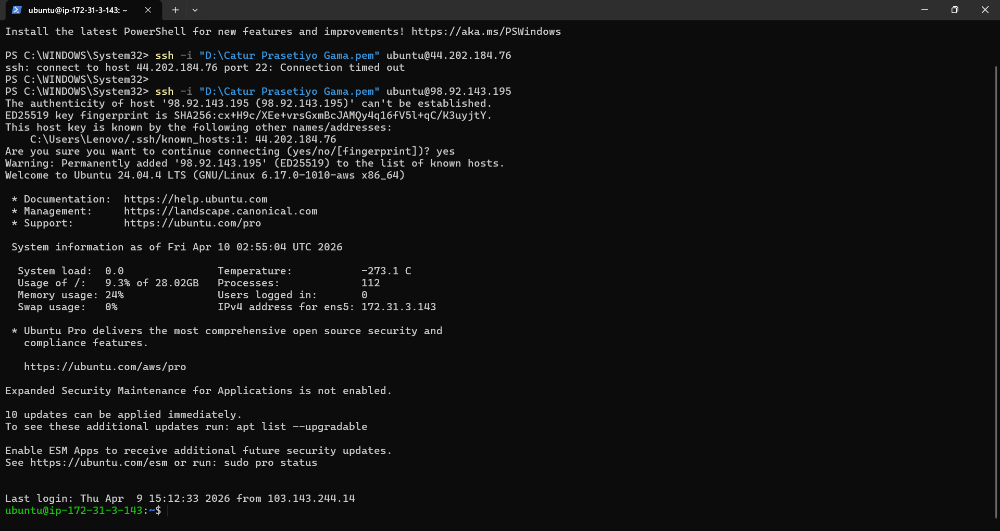
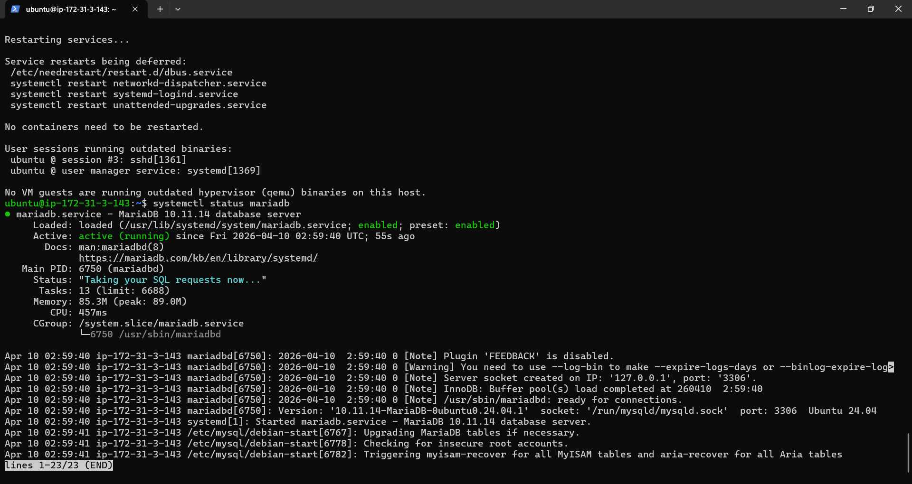
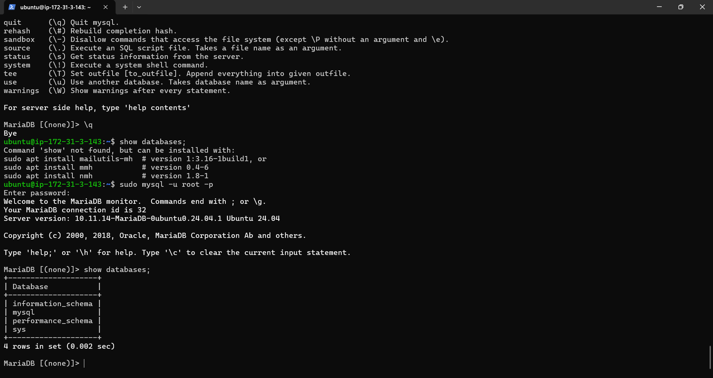
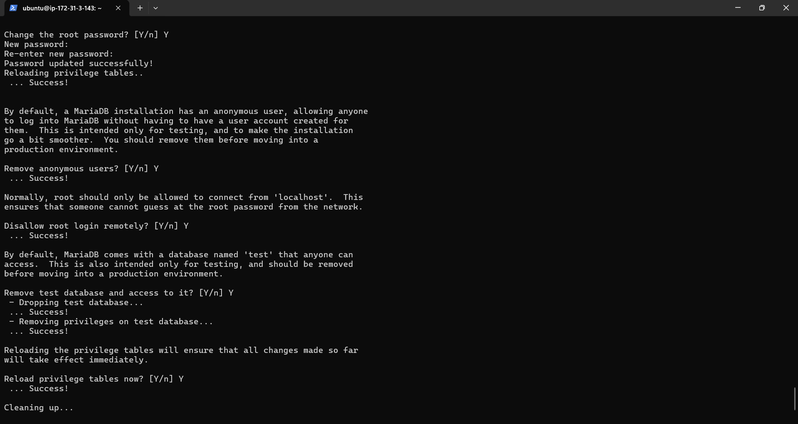
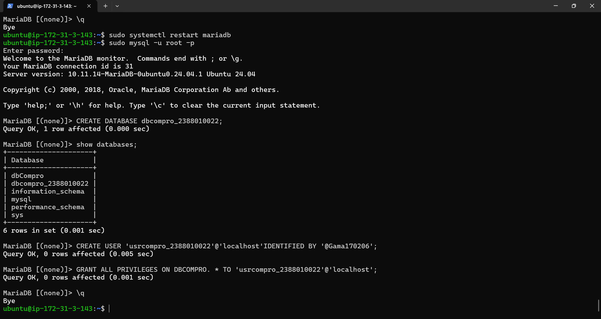
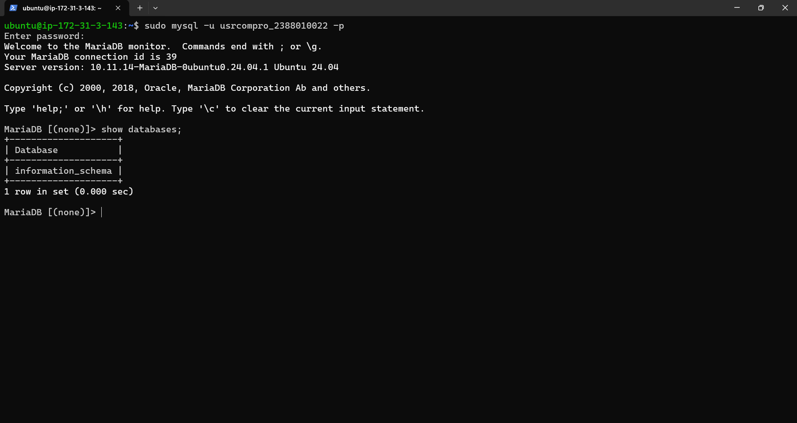

#Setting up Database di AWS EC2 menggunakan Maria DB

1. Aktifkan Instance AWS EC2
2. Remote Insteance Via open SSH PowerShell / Putty

3. Patching OS (sudo apt-get update && sudo apt-get upgrade)
4. Install Mariadb (sudo apt install mariadb-server -y)
- cek status MariaDB (systemctl status mariadb)
- coba apakah default setting yg berlaku (sudo mysql -u root -p)
- Cek apakah masih ada database dummy (show databases;)

5. Kita Lakukan Hardening Security
- Masukan Command (sudo mysql_secure_installation)
- masukan password kuat untuk user root
- Remove anonymous users (Y)
- Disallow root login remotely (Y)
- Remove test database and access to it (Y)
- Reload privilege tables now (Y)

6. Membuat database dan User
- login sebagai root
- Membuat database untuk Web Company Profile (create database dbCompro;)
- Membuat User untuk Web Company Profile (create user 'userCompro'@'localhost' identified by '********';)
- Memberikan Hak Akses User untuk Web Company Profile (grant all privileges on dbCompro.* to 'userCompro'@'localhost';)
- Flush Privilege (flush privileges;)
- Keluar dari MySQL (exit;)

7. Login sebagai user baru
- Masukan Command (mysql -u userCompro -p)
- Masukan Password
- Cek apakah database dbCompro sudah ada (show databases;)
