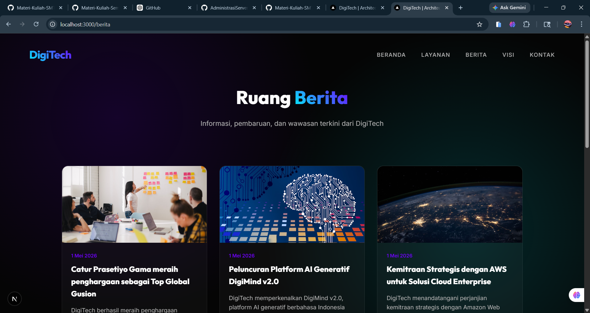

# Deploy Web Apps Framework Next.js ke AWS

## 1. Pastikan Web Apps Berjalan di Local

### Setup Aplikasi
- Install dependensi dengan menjalankan `npm install`
- Create database dan import file SQL
- Create file `.env` dan sesuaikan konfigurasi dengan database lokal

### Menjalankan Aplikasi
- Jalankan aplikasi dengan perintah `npm run dev`
- Akses aplikasi melalui browser pada URL `http://localhost:3000`

### Pengujian Aplikasi

**Frontend Testing:**
- Verifikasi tampilan aplikasi muncul dengan benar
- Pastikan tidak ada error di console browser

**Backend Testing:**
- Akses halaman admin di `http://localhost:3000/admin`
- Login menggunakan credentials berikut:
  - Username: `admin`
  - Password: `admin123`

## 2. Persiapan Build dan Packaging

### Build Aplikasi
- Generate static files dengan menjalankan `npm run build`

### Membuat Package untuk Deployment
- Archive folder `standalone` dengan langkah berikut:
  1. Klik kanan pada folder `standalone`
  2. Pilih menu **Send to**
  3. Pilih **Compressed (zipped) folder**